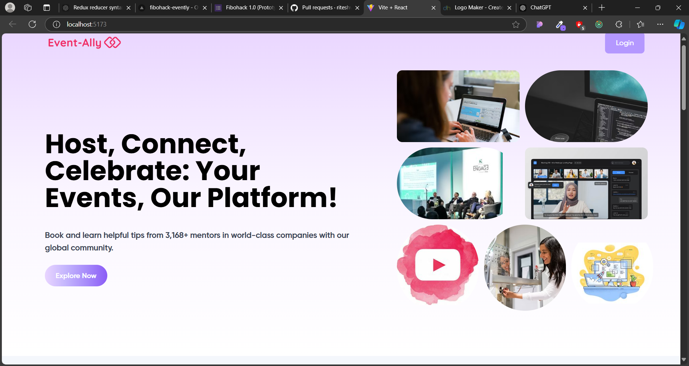

# Event Management Website

A modern web application for creating, managing, and discovering events. Built with React and React Router, this platform provides a seamless experience for both event organizers and attendees.

## 🌟 Features

- **User Authentication**
  - Login/Signup functionality
  - Secure user sessions
  - Password recovery (coming soon)

- **Event Management**
  - Create and publish events
  - Detailed event information
  - Event search and filtering
  - View event details

- **User Dashboard**
  - Personal profile management
  - Event history
  - Saved events
  - User preferences

## 🚀 Getting Started

### Prerequisites
- Node.js (v14.0.0 or higher)
- npm (v6.0.0 or higher)

### Installation

1. Clone the repository
```bash
git clone https://github.com/riteshvish02/fibohack-evently
```

2. Install dependencies
```bash
npm install
```

3. Start the development server
```bash
npm run dev
```

The application will be available at `http://localhost:5173`

## 🛣️ Project Structure

```
src/
├── Components/
│   ├── Home.js          # Landing page
│   ├── Login.js         # User authentication
│   ├── CreateAccount.js # User registration
│   ├── FindEvent.js     # Event discovery
│   ├── CreateEvent.js   # Event creation
│   ├── Eventdets.js     # Event details
│   └── Userdashboard.js # User profile
└── App.js               # Main routing configuration
```

## 🔄 Available Routes

- `/` - Home page
- `/login` - User login
- `/createaccount` - New user registration
- `/events` - Event discovery
- `/createevent` - Create new event
- `/eventdetails` - Event information
- `/userprofile` - User dashboard

## 🛠️ Built With

- [React](https://reactjs.org/) - Frontend framework
- [React Router](https://reactrouter.com/) - Navigation and routing
- [Other dependencies to be added...]


## 📜 License

This project is licensed under the MIT License - see the [LICENSE.md](LICENSE.md) file for details

## 🤝 Support

For support, email [rv504263@gmail.com] or open an issue in the repository.

## 🔮 Future Enhancements

- Event categories and tags
- Advanced search filters
- Social sharing integration
- Payment gateway integration
- Event analytics
- Mobile application

## 📸 Screenshots
### Home Page



## ✨ Acknowledgments

- Hat tip to anyone whose code was used
- Inspiration
- References
